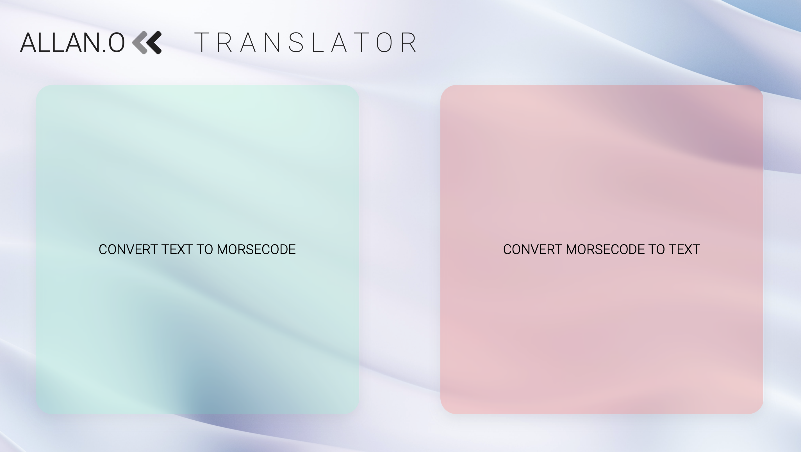
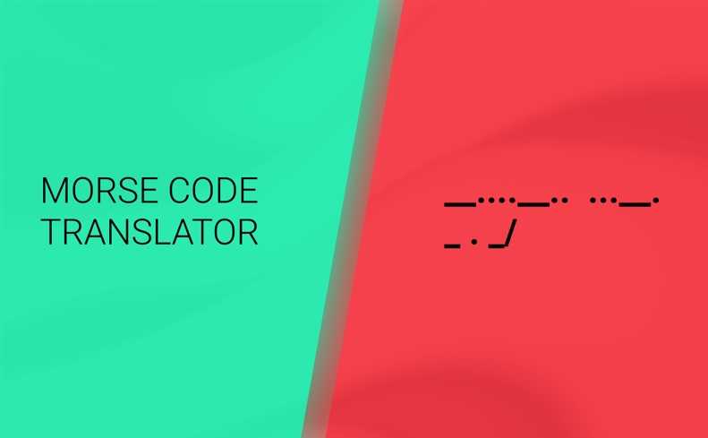

# Javascript Morse Code Translator

&nbsp;
Hi, this is my vanilla JS morse code translator. It's made using vanilla Javascript, HTML & SCSS via a Object Oriented Test Driven mobile-first approach. Using JEST, I made unit tests for the singleCharacterConverter and translator classes, which I made for conversion of morse code to text and vice versa.

<!-- ## Prototype UI design using Figma

 -->

## More about this project

This translator works by simply entering/typing the text into the green box, which will then be translated in real-time to morse code. For the real-time translation of morse code back into text, simply input the desired morse code to be into the red box. In making this morse-code, a "dictionary" of text-morse codes was required. This was achieved by making a class 'singleCharacterConverter' which first validates between text/morse code, and then through comparison of Object.values and Object.values returns the value at the given index in required array.

This functionality was applied to entire sentences by the translator class, which reads each letter that is being inputted and applies the functionality of the 'singleCharacterConverter' class to each character by splitting, mapping and returning the appropriate character, and then finally joining the array elements to form a string. One challenge was making sure that morse code characters can be accurately translated despite consisting of multiple symbols. To overcome this, morse code characters must have a blank space between each, and words in sentences must have a space and '/' between each. Incorrect symbols, will simply be ignored by each translator.

JEST tests were written and performed on both translator and singleCharacterConverter classes to ensure accurate input validation and accurate translation.

-Click [here](https://www.figma.com/file/XyBqK9o6M1hycyFMg7f0Ue/Allan's-Morse-Code-Translator) to see the figma UI prototype.
-There is more info in the JS files :)

## Future Improvements & Planned Bug Fixes

- Ability for conversion of morse code into sound (possible incorporation of API)
- Any necessary refactoring of code for readability

#### Thanks for reading!-Allan :)
